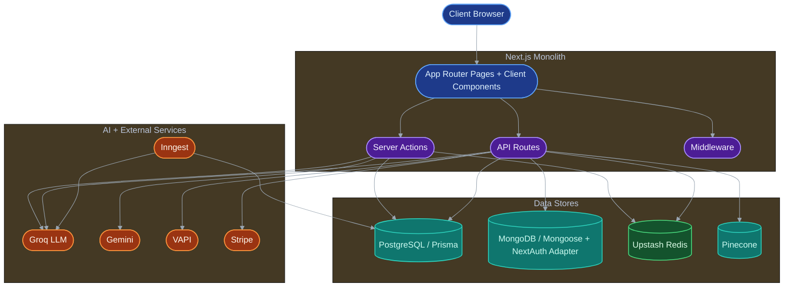
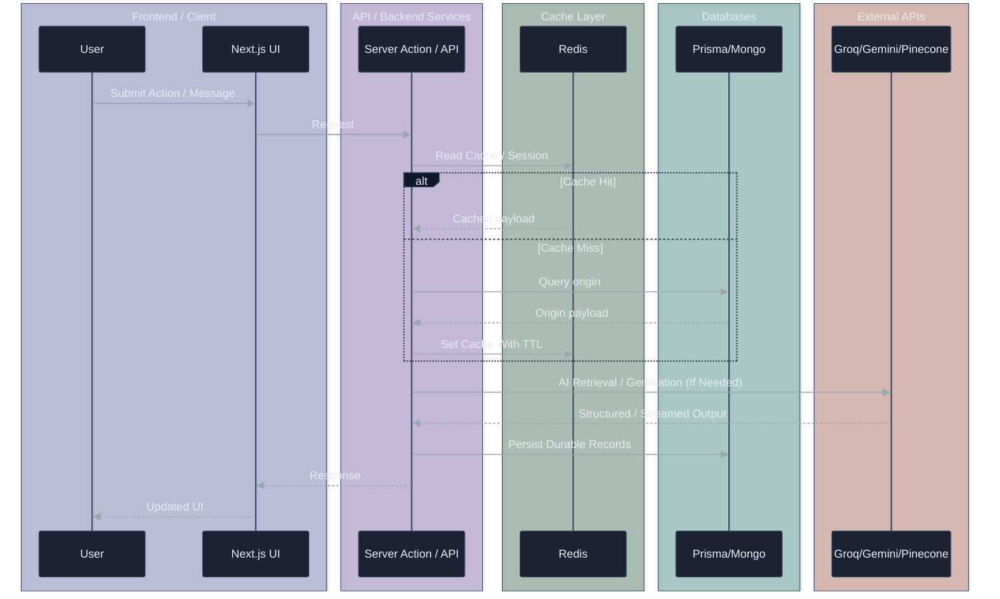
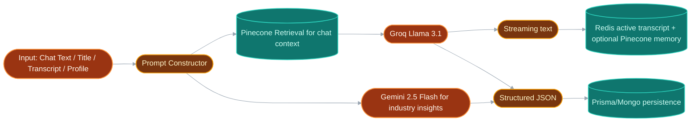
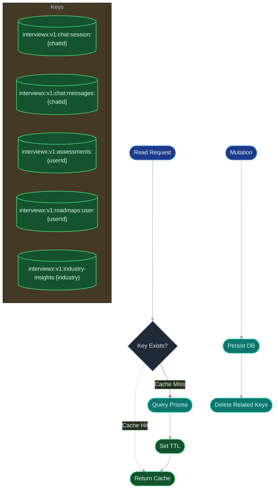
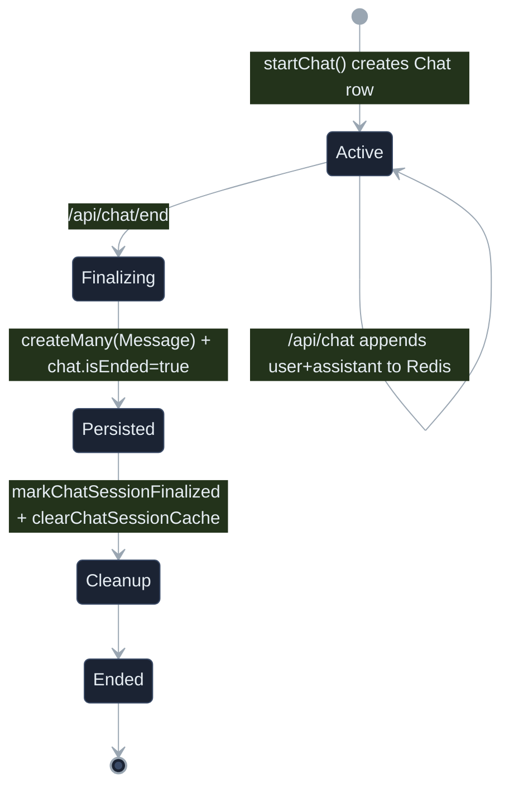
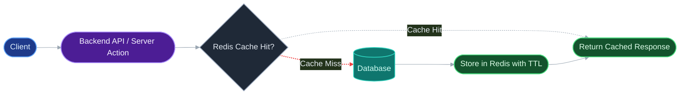

# InterviewX: Comprehensive Technical Documentation

This document is derived from the current repository implementation (Next.js App Router + Server Actions + API Routes) and explains system behavior, architecture, data flow, and design decisions.

## 1. Complete System Architecture

### 1.1 System Components
- Presentation layer:
  - Next.js route groups: `(auth)`, `(marketing)`, `(root)`, and `tools`.
  - Client components for chat streaming UI, resume editing, quiz, and roadmap visualization.
- Application layer:
  - Server Actions for user profile, resume CRUD, quiz save/fetch, roadmap generation/history, chat lifecycle bootstrap, and payment gating.
  - API routes for streaming chat, chat finalize/hydration, Stripe checkout/webhooks, NextAuth callbacks, VAPI question generation, signup, and Inngest runtime endpoint.
- Data layer:
  - PostgreSQL via Prisma for core product entities.
  - MongoDB via Mongoose + NextAuth Mongo adapter for auth users and interview artifacts.
  - Upstash Redis for cache-aside data and active live chat session buffer.
  - Pinecone for semantic memory retrieval (chat context).
- Integration layer:
  - Groq (Llama 3.1) for most generation tasks.
  - Gemini for industry insight generation.
  - VAPI for voice interview runtime.
  - Stripe for subscriptions.
  - Inngest for scheduled weekly insight refresh.

### 1.2 High-Level Architecture Diagram

### 1.3 Data Flow Diagram

### 1.4 AI Pipeline Architecture Diagram

### 1.5 Redis Caching Architecture Diagram

### 1.6 Chat Session Lifecycle Diagram

## 2. Detailed Pipeline Explanations

### 2.1 Chat Message Pipeline
1. Chat starts with server action `startChat()` creating a Prisma `Chat` record.
2. Frontend sends user prompt to `/api/chat` with `chatId` and current message.
3. Route checks NextAuth session and resolves Prisma user via `authUserId`.
4. User message is appended to Redis (`chat:messages`) through `appendChatMessage()`.
5. Pinecone semantic retrieval (`retrieveMemories`) fetches top-5 relevant memory chunks from namespace `chatId`.
6. Groq chat completion streams assistant output.
7. Stream tokens are returned to client progressively.
8. Final assistant text is appended to Redis and upserted into Pinecone memory.

### 2.2 Chat Session Lifecycle
- Live hydration:
  - `GET /api/chat/live?chatId=...` first reads Redis message list.
  - If no Redis data, falls back to Prisma `Message` rows ordered ascending.
- Ending session:
  - `POST /api/chat/end` resolves transcript from Redis (preferred) or client payload fallback.
  - Filters valid roles (`user`, `assistant`) and non-empty content.
  - Generates short chat title from transcript (Groq, fallback to first user message slice).
  - Writes messages + chat end flag atomically using Prisma transaction.
  - Marks Redis session finalized and clears Redis chat keys.

### 2.3 AI Insight Generation Pipeline
- On-demand (`getIndustryInshights`):
  - Read Redis by `industry-insights:{industry}`.
  - If miss, check Prisma `IndustryInsight.nextUpdate` freshness.
  - If stale/missing, call Gemini with strict JSON prompt and upsert Prisma row.
  - Redis TTL is dynamic up to the next update timestamp, capped by max TTL.
- Scheduled refresh:
  - Inngest cron (`0 0 * * 0`) invokes Groq pipeline and upserts industry data weekly.

### 2.4 Redis Caching Flow
- Cache-aside (`withCache`) used for:
  - Assessment history by user.
  - Roadmap history by user.
- Manual read-through + freshness logic used for:
  - Industry insights.
- Active-session buffering used for:
  - Live chat messages and chat metadata.

### 2.5 Cache Invalidation Logic
- Assessments:
  - On quiz save and clear-history, delete `assessments:{userId}`.
- Roadmaps:
  - On roadmap create and delete-all, delete `roadmaps:user:{userId}`.
- Chat sessions:
  - On finalize, clear chat session + message keys.
- Industry insights:
  - Regeneration overwrites cache with new TTL rather than explicit delete-first.

### 2.6 Database Persistence Pipelines
- Prisma persistence:
  - User profile mirror, chats/messages, assessments, roadmaps, resumes and children, industry insights.
- Mongo persistence:
  - NextAuth user records + subscription metadata.
  - Interview questions and AI interview feedback collections.
- Cross-store identity bridge:
  - Session `user._id` (Mongo) maps to Prisma `User.authUserId`.

## 3. Redis Caching Architecture

### 3.1 Cache Key Design
Namespace prefixing strategy from code:
- Prefix: `interviewx:v1`.
- Entity keys:
  - Chat session and message list keyed by `chatId`.
  - Assessment and roadmap history keyed by Prisma user id.
  - Industry insights keyed by normalized industry slug.

This design reduces collision risk and allows explicit versioning for future migrations.

### 3.2 TTL Strategy
- `CHAT_ACTIVE_SECONDS`: 6 hours.
- `CHAT_FINALIZED_SECONDS`: 30 minutes.
- `ASSESSMENTS_SECONDS`: 24 hours.
- `ROADMAP_LIST_SECONDS`: 24 hours.
- `INSIGHTS_MAX_SECONDS`: 8 days max cap, with dynamic shorter TTL to next scheduled update.

### 3.3 Cache Invalidation
- Event-driven invalidation on writes/deletes for assessments and roadmaps.
- Chat-specific cleanup once transcript is durably persisted.
- Insights refreshed by timestamp-driven regeneration and upsert.

### 3.4 Performance Benefits
- Reduced DB load for high-read pages (dashboard history and trend views).
- Better perceived latency for chat due to Redis-backed active transcript.
- Lower repeated computation cost for expensive AI outputs.

## 4. Performance Benchmarking & Latency Optimization

InterviewX uses a Redis cache-aside architecture (Upstash Redis) to accelerate database-heavy read paths, especially for repeated history/list retrieval operations.

### 4.1 Cache-Aside Architecture
- Read flow:
  1. Backend checks Redis key.
  2. On hit, cached payload is returned immediately.
  3. On miss, backend queries PostgreSQL via Prisma, then writes result into Redis with TTL.
- Write flow:
  - After data mutations, related keys are invalidated to prevent stale reads.

Simple cache path:

### 4.2 Benchmark Methodology
- Benchmark script: `scripts/measure-redis-latency.mjs`.
- Measurement target: backend read-path latency (storage retrieval path only), not frontend render time.
- Timing primitive: `performance.now()`.
- Test modes:
  - Cold-cache mode: force key delete, then execute Redis miss + database query + cache set.
  - Warm-cache mode: pre-seed key, then execute Redis hit path.
- Repeated multi-run sampling with percentile analysis (`p50`, `p95`) plus average latency.

### 4.3 Measured Results
Benchmark output (saved under `scripts/benchmark-results`) reported:

- Combined p50 latency reduction: 87.81%
- Combined p95 latency reduction: 92.92%
- Combined average latency reduction: 89.73%

These reductions were observed on backend data fetch paths where Redis serves repeated reads faster than querying the database for each request.

### 4.4 Why Redis Improves Latency
- Redis serves data from memory, which is substantially faster than repeated database query execution.
- Warm-cache requests avoid repeated SQL planning/execution and related index/disk access overhead.
- Lower read latency improves user-perceived responsiveness on high-frequency endpoints and reduces load pressure on primary databases.

### 4.5 Why This Matters for Scalability and UX
- Better tail latency (`p95`) helps maintain consistent response times under load spikes.
- Faster read paths increase headroom before database bottlenecks appear.
- Lower backend latency improves interaction smoothness for history dashboards, trend views, and repeated tool access.

## 5. Database Design

### 5.1 PostgreSQL (Prisma) Domain Models
- `User`: relational profile linked by `authUserId` (Mongo identity bridge), skills array, onboarding fields.
- `Chat` and `Message`: persisted conversation history after explicit chat end.
- `Assessment`: quiz result snapshots with `questions` JSON array and optional AI tip.
- `Resume`, `Experience`, `Education`, `Skill`: structured resume data with 1-to-many relations.
- `IndustryInsight`: salary/trend snapshots with enums for demand and outlook.
- `Roadmap`: JSON graph payload (`nodes`, `edges`) with metadata.

### 5.2 MongoDB Models
- `User` (auth adapter + payment fields): credentials/OAuth identity and Stripe metadata.
- `Interviews`: generated interview metadata and question arrays.
- `FeedBack`: scored interview feedback and category breakdown.

### 5.3 Relationship Notes
- Prisma and Mongo are intentionally split by domain responsibility.
- `authUserId` in Prisma user table is the join bridge to Mongo-auth identity.
- Stripe updates subscription state directly in Mongo user records.

### 5.4 Redis and DB Interaction
- Redis does not replace durable storage.
- Redis buffers live sessions and accelerates reads; final source of truth remains Prisma/Mongo.

## 6. AI Architecture

### 6.1 AI Providers by Use Case
- Groq (Llama 3.1):
  - Chat streaming responses.
  - Quiz generation and improvement tips.
  - Interview feedback scoring.
  - Roadmap generation.
  - Interview question generation for VAPI endpoint.
  - Inngest weekly insights generation.
- Gemini (2.5 Flash):
  - On-demand industry insights generation path.
- VAPI:
  - Voice interaction lifecycle and transcript events.

### 6.2 Prompting and Output Handling
- Most prompts request strict JSON with cleanup and parse guards.
- Interview feedback normalized and validated against Zod schema before save.
- Roadmap and quiz flows include JSON cleanup and structure checks.

### 6.3 RAG/Memory Behavior
- Chat uses Pinecone namespace scoped by `chatId`.
- On each user prompt:
  - Retrieve top-k semantic memories.
  - Inject memory block into system context.
  - Stream response.
  - Store user and assistant texts back into Pinecone.

### 6.4 Chat History Usage
- Live phase: Redis serves current session transcript.
- Historical phase: after ending chat, persisted Prisma `Message` rows serve history pages.

## 7. Performance Design Decisions

### 7.1 Why Redis Here
- Chat sessions are high-frequency and short-lived; Redis is ideal for rapid append/read.
- History/list endpoints repeatedly query similar data; cache-aside avoids redundant Prisma hits.

### 7.2 Query Optimization Choices
- Prisma indexes:
  - Chats by `(userId, createdAt)`.
  - Industry insight by `industry`.
  - Assessments and roadmaps by `userId`.
- Scoped queries by authenticated user id protect data and reduce broad scans.

### 7.3 Chat Storage Strategy
- Design uses delayed durable persistence (on chat end) to reduce write amplification during token streaming.
- Redis acts as transient session state until explicit finalization.

### 7.4 Runtime and Build Choices
- Node runtime is explicitly used in handlers where required behavior matters (chat stream and Stripe webhook).
- `postinstall` runs Prisma generate for deployment consistency.

## 8. Scalability Considerations

### 8.1 Current Scaling Strengths
- Stateless Next.js API/server-action pattern (horizontal scaling friendly).
- Externalized state to managed datastores/services (Redis, DBs, Stripe, Pinecone, AI APIs).
- Cache version/prefix strategy supports future key evolution.

### 8.2 Scale Risks and Bottlenecks
- Dual write model across Prisma and Mongo adds operational complexity.
- Some AI output parsing is heuristic and may require stronger schema enforcement at high volume.
- Chat end persistence depends on explicit user action to finalize.

### 8.3 Practical Next Scaling Steps
- Add queue-based asynchronous persistence fallback for chat finalization.
- Add route-level rate limiting on AI-heavy endpoints.
- Add distributed tracing and cache hit-rate metrics.
- Add partition/retention strategy for large transcript/message volumes.

## 9. Security Considerations

### 9.1 Authentication and Identity
- NextAuth with:
  - Credentials provider (bcrypt compare).
  - Google and GitHub OAuth providers.
  - JWT session strategy with `_id` propagated into session token.
- API and actions enforce session checks before protected operations.

### 9.2 API Protection
- Ownership checks are implemented in critical flows:
  - Chat read/end operations verify chat belongs to authenticated user.
  - Resume updates verify resume ownership.
  - Assessment/roadmap operations are user-scoped.

### 9.3 Data Handling
- Secrets are read from environment variables.
- Stripe webhook signature verification is enforced.
- Passwords are hashed for credentials sign-up.

### 9.4 Security Gaps to Address
- Middleware route matching is currently static string based and may not fully cover dynamic segments.
- Build currently ignores TypeScript errors (`ignoreBuildErrors: true`), which can hide unsafe regressions.
- Add centralized input validation on all public API routes.

## 10. Rights and License

### 10.1 Repository Ownership
- This repository belongs to Amber Hasan.

### 10.2 License Status
- No top-level LICENSE file is currently present in this repository.
- In the absence of an explicit license grant, all rights are reserved by the repository owner.

### 10.3 Third-Party Rights
- Third-party libraries, platforms, and services integrated by this project are governed by their own licenses and terms.
- Referenced logos, trademarks, and linked documentation remain the property of their respective owners.

## Appendix: API Route Inventory
- `POST /api/chat` - stream AI response, Redis append, Pinecone memory store.
- `GET /api/chat/live` - live transcript from Redis with Prisma fallback.
- `POST /api/chat/end` - finalize transcript to Prisma, title generation, Redis cleanup.
- `POST /api/vapi/generate` - generate interview question list and persist to Mongo.
- `POST /api/stripe/checkout` - create checkout session and stripe customer mapping.
- `POST /api/stripe/webhook` - subscription lifecycle sync into Mongo user.
- `GET/POST /api/auth/[...nextauth]` - auth handler.
- `POST /api/sign-up` - credentials registration into Mongo user collection.
- `GET/POST/PUT /api/inngest` - inngest serve endpoint.

## Appendix: Deployment and Runtime Notes
- Runtime: Next.js 16 app with Node runtime on stream/webhook critical handlers.
- Build scripts:
  - `npm run dev`
  - `npm run build`
  - `npm run start`
  - `postinstall: prisma generate`
- Infrastructure dependencies:
  - PostgreSQL, MongoDB, Upstash Redis, Pinecone, Groq, Gemini, Stripe, VAPI, Inngest.
