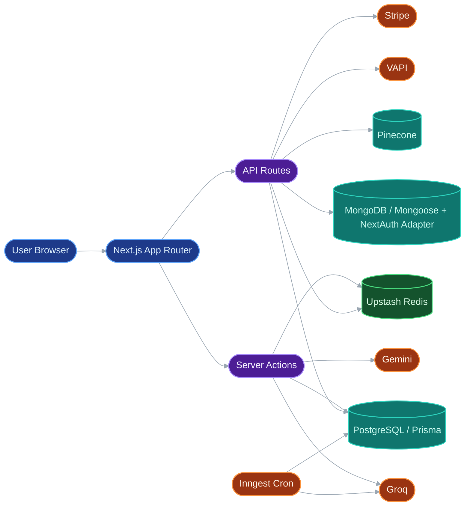
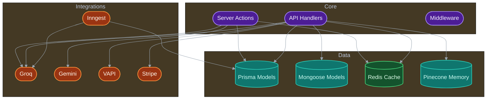
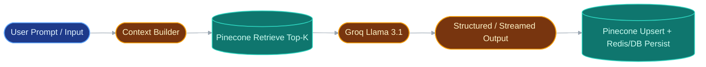
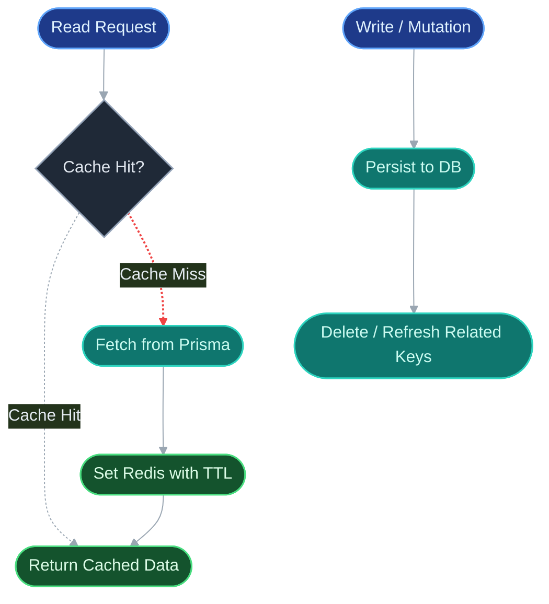

# InterviewX

AI-powered interview preparation platform that unifies coaching chat, resume building, quiz assessment, industry insights, and voice mock interviews.

## 1. Project Title & Tagline
InterviewX: a full-stack AI career preparation suite built as a Next.js monolith.

## 2. Problem Statement
Interview preparation is usually fragmented across multiple tools: resume editors, question banks, chat assistants, and separate analytics. This increases context-switching and weakens feedback loops.

InterviewX targets students and professionals preparing for technical careers by providing one platform for:
- Practice (quiz + mock interviews)
- Improvement (AI feedback + resume enhancement)
- Direction (industry insights + learning roadmaps)

## 3. Solution
InterviewX combines interactive frontend workflows with server actions and API routes backed by PostgreSQL, MongoDB, Redis, and AI services.

At a high level:
- Users authenticate with credentials/OAuth.
- The app mirrors the authenticated user into Prisma for relational features.
- AI pipelines generate quizzes, roadmaps, chat responses, and interview feedback.
- Redis and Pinecone reduce latency and preserve conversational context.
- Stripe + webhook updates subscription state.

## 4. Key Features
- AI career chat with streaming responses.
- Redis-backed live chat session buffering.
- Pinecone semantic memory retrieval for contextual chat replies.
- Voice interview pipeline (VAPI) with AI-generated question sets.
- Transcript-to-feedback scoring pipeline for interview performance.
- Resume management with AI enhancement for summary and experience text.
- Technical quiz generation, scoring, and personalized improvement tips.
- AI roadmap generation rendered as node/edge graphs in React Flow.
- Industry insights with Redis cache + scheduled weekly refresh via Inngest.
- Hybrid persistence architecture (PostgreSQL + MongoDB).

## 5. Tech Stack
- Frontend: Next.js 16 (App Router), React 19, TypeScript, Tailwind CSS, Radix UI, Recharts, React Flow.
- Backend: Next.js Server Actions + API Routes.
- Datastores:
  - PostgreSQL via Prisma for product domain entities.
  - MongoDB via Mongoose + MongoDB adapter for auth/interview artifacts.
  - Redis (Upstash) for caching and active chat state.
  - Pinecone for chat semantic memory retrieval.
- AI: Groq (Llama 3.1), Google Gemini, VAPI voice runtime.
- Background Jobs: Inngest (cron function for insights refresh).
- Auth: NextAuth (Credentials, Google, GitHub).
- Payments: Stripe Checkout + webhook lifecycle handling.

## 6. System Architecture
### High-Level System


### Backend Component View


### AI Processing Pipeline


### Redis Caching Layer


## 7. Core Pipelines
- Chat pipeline:
  1. User message posted to `/api/chat`.
  2. Message appended to Redis active-session store.
  3. Top memories retrieved from Pinecone namespace keyed by `chatId`.
  4. Groq streams assistant response.
  5. Assistant response appended to Redis and stored in Pinecone.
  6. `/api/chat/end` finalizes transcript to PostgreSQL and clears Redis keys.

- Redis caching flow:
  - Cache-aside for assessments, roadmap history, and industry insights.
  - Active live-chat buffer kept in Redis with dedicated TTL strategy.

- Interview pipeline:
  - VAPI workflow calls `/api/vapi/generate` to create interview question sets.
  - Questions are stored in MongoDB interviews collection.
  - Interview transcript is evaluated by Groq and validated with Zod before feedback persistence.

- Insights pipeline:
  - On-demand in `getIndustryInshights()` with Redis short-circuit.
  - Weekly refresh via Inngest cron function and Prisma upsert.

- Roadmap pipeline:
  - Groq generates strict JSON node/edge roadmap.
  - Result normalized and persisted in Prisma.
  - Frontend renders graph with React Flow custom nodes.

## 8. Project Structure
```text
src/
  app/
    (auth)/, (marketing)/, (root)/, tools/, api/
  actions/          # server-side domain workflows
  components/       # feature and reusable UI
  lib/              # service clients, cache, db helpers, AI helpers
  models/           # mongoose schemas for Mongo-backed entities
  constants/        # VAPI config, zod schemas, mappings
  hooks/            # shared hooks (use-fetch)
prisma/
  schema.prisma
  migrations/
```

## 9. How the System Works
1. User signs in with NextAuth (credentials/Google/GitHub).
2. User profile is synchronized to Prisma (`authUserId` bridge).
3. User accesses tools (onboarding, chat, quiz, roadmap, resume).
4. AI actions/routes call Groq/Gemini and enforce structured outputs.
5. Redis accelerates reads and stores active chat session state.
6. Pinecone adds semantic memory for chat relevance.
7. Final artifacts persist in PostgreSQL/MongoDB.
8. Stripe webhooks update subscription flags in MongoDB.

## 10. Installation
```bash
git clone <your-repository-url>
cd interview_x
npm install
```

## 11. Running the Project
```bash
# local development
npm run dev

# production build
npm run build
npm run start

# optional: run inngest dev for local event/cron testing
npx inngest-cli@latest dev
```

## 12. Environment Variables
Required by current code paths:

```env
# Core
DATABASE_URL=
MONGODB_URI=
NEXTAUTH_SECRET=

# Auth Providers
GOOGLE_CLIENT_ID=
GOOGLE_CLIENT_SECRET=
GITHUB_CLIENT_ID=
GITHUB_CLIENT_SECRET=

# AI Providers
GROQ_API_KEY=
GEMINI_API_KEY=
PINECONE_API_KEY=

# VAPI
NEXT_PUBLIC_VAPI_WEB_TOKEN=
NEXT_PUBLIC_VAPI_WORKFLOW_ID=

# Redis
UPSTASH_REDIS_REST_URL=
UPSTASH_REDIS_REST_TOKEN=

# Stripe
STRIPE_SECRET_KEY=
STRIPE_WEBHOOK_SECRET=
STRIPE_MONTHLY_PRICE_ID=
STRIPE_YEARLY_PRICE_ID=
NEXT_PUBLIC_STRIPE_PUBLISHABLE_KEY=
NEXT_PUBLIC_STRIPE_CUSTOMER_PORTAL_URL=
NEXT_PUBLIC_URL=

# App Controls
NEXT_PUBLIC_ADMIN_EMAIL=
```

Also present in the repository `.env`: `OPENAI_API_KEY`, `PINECONE_INDEX`, `STRIPE_MONTHLY_PLAN_LINK`, `STRIPE_YEARLY_PLAN_LINK`, and internal Next/Prisma flags.

## 13. Performance Optimizations
- Redis cache-aside strategy for frequently read datasets.
- Redis active-session buffering for chat before durable persistence.
- Targeted cache invalidation after write operations.
- Prisma relation modeling with indexes on high-frequency query paths (`chat`, `assessment`, `industry`, `roadmap`).
- Streaming AI responses to reduce perceived latency.
- Global singleton patterns for Prisma and Mongo clients in development.

## 14. Performance Benchmarking & Latency Optimization
InterviewX uses a Redis cache-aside architecture (Upstash Redis) to optimize database-heavy read operations.

A benchmark script at `scripts/measure-redis-latency.mjs` measures cold-cache paths (DB query + cache set) versus warm-cache paths (Redis hit) using `performance.now()` across multiple runs, then reports percentile metrics (`p50`, `p95`) and average latency.

Measured backend read-path improvements:
- Combined p50 latency reduction: 87.81%
- Combined p95 latency reduction: 92.92%
- Combined average latency reduction: 89.73%

These metrics represent backend retrieval time improvements (Redis vs database), not full end-to-end UI rendering time. Redis improves this path by serving data from in-memory storage, avoiding repeated database query planning, execution, and disk/index overhead on hot reads.

## 15. Rights and License
- Repository ownership: This repository belongs to Amber Hasan.
- License status: No top-level LICENSE file is currently present.
- Rights notice: Until a license is explicitly added, all rights are reserved by the repository owner.
- Third-party notice: External services, SDKs, logos, and trademarks used by this project remain under their respective licenses and terms.


